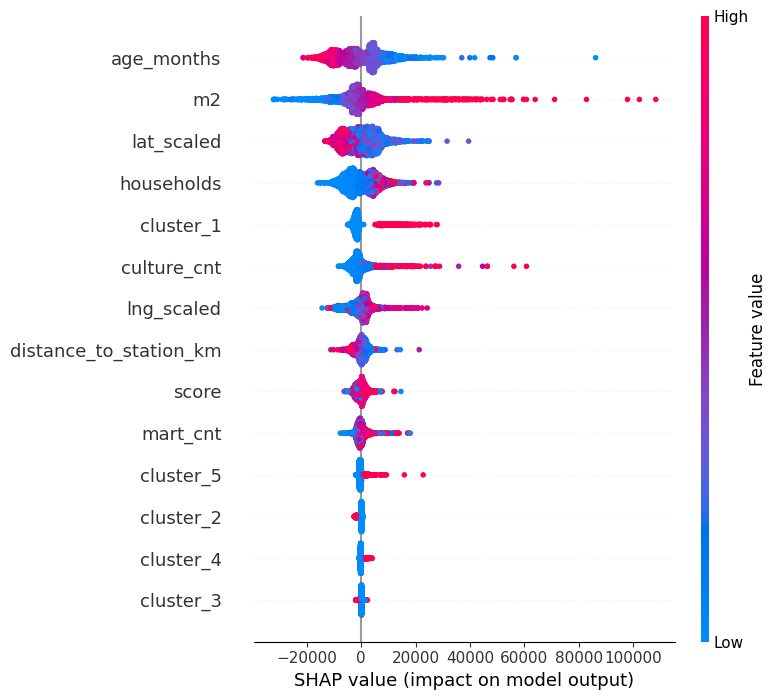
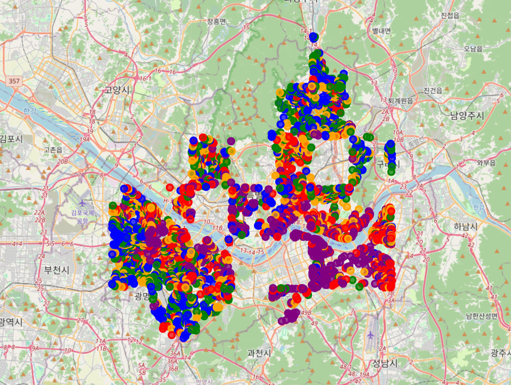
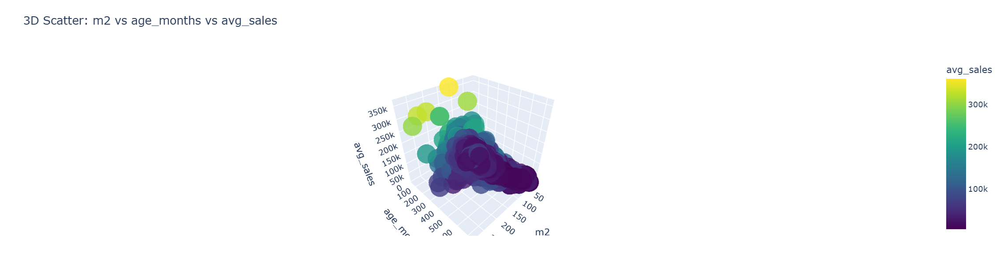

# Seoul Apartment Price Prediction with Explainable AI

서울 아파트 평균 매매가를 예측하고, 설명 가능한 인공지능(XAI) 기법을 활용해 가격 결정 요인을 해석한 머신러닝 프로젝트입니다.

단순히 예측 정확도를 높이는 데 그치지 않고, **어떤 변수들이 가격 상승과 하락에 영향을 주는지**를 SHAP, LIME, PDP 등의 기법을 통해 분석하는 데 초점을 두었습니다.

---

## 1. Project Overview

최근 서울 아파트 가격은 금리, 입지, 연식, 교통 접근성, 생활 인프라 등 다양한 요인이 복합적으로 작용하며 형성됩니다.  
본 프로젝트는 Kaggle의 **Seoul Real Estate Dataset**을 기반으로 서울 아파트 평균 매매가(`avg_sales`)를 예측하고, 외부 데이터를 결합해 설명력을 높인 뒤, XAI 기법을 통해 가격 결정 구조를 해석하는 것을 목표로 합니다.

### Objectives
- 서울 아파트 평균 매매가 예측 모델 구축
- 다양한 회귀 모델 성능 비교
- 외부 데이터 결합을 통한 설명력 강화
- SHAP, LIME, PDP, Proxy Model 기반 가격 결정 요인 해석

---

## 2. Dataset

### Main Dataset
- **Seoul Real Estate Dataset (Kaggle)**
- Link: https://www.kaggle.com/datasets/jcy1996/seoul-real-estate-datasets

### Target Variable
- `avg_sales`: 평균 매매가

### Input Features
- `lat`, `lng`: 위도, 경도
- `households`: 세대수
- `buildDate`: 건축일
- `score`: 아파트 평가 점수
- `m2`: 전용면적
- `p`: 층수

프로젝트에서는 `id`, `min_sales`, `max_sales`는 예측 변수에서 제외하였고, 서울 외 지역 데이터와 결측치, 비정상값을 제거하여 분석에 활용했습니다.

---

## 3. Data Preprocessing

주요 전처리 과정은 다음과 같습니다.

- 서울 외 지역 데이터 제거
- `avg_sales` 결측치 제거
- `m2 = 0` 이상치 제거
- `p`와 `m2` 간 높은 상관으로 인해 `p` 제거
- `buildDate`를 활용해 `age_months`(연식) 파생 변수 생성
- `lat`, `lng`에는 `StandardScaler`, 나머지 수치형 변수에는 `RobustScaler` 적용

### Engineered Features
- `age_months`: 건축일 기준 아파트 연식
- `distance_to_station_km`: 가장 가까운 지하철역까지 거리
- `mart_cnt`: 반경 800m 내 마트/슈퍼 개수
- `culture_cnt`: 반경 800m 내 문화시설 개수
- `cluster`: 지역 기반 KMeans 클러스터링 결과

---

## 4. External Data Integration

원본 데이터의 한계를 보완하기 위해 외부 데이터를 결합했습니다.

### 1) Subway Accessibility
서울 열린데이터 광장의 지하철역 위치 데이터를 활용해 각 아파트와 가장 가까운 역까지의 거리를 계산했습니다.  
거리 계산에는 **Haversine Distance**를 사용하여 실제 위치 기반 거리를 반영했습니다.

- Link: https://data.seoul.go.kr/dataList/OA-21213/S/1/datasetView.do

### 2) Local Infrastructure
카카오 로컬 API를 활용해 아파트 반경 800m 이내의 생활 편의시설 개수를 수집했습니다.

- `mart_cnt`: 마트/슈퍼 개수
- `culture_cnt`: 문화시설 개수

- Link: https://apis.map.kakao.com/

---

## 5. Exploratory Data Analysis

EDA를 통해 확인한 주요 인사이트는 다음과 같습니다.

- **면적(`m2`)이 평균 매매가와 가장 강한 양의 상관관계**
- **연식(`age_months`)은 가격과 음의 관계**
- **역과 가까울수록 가격이 높은 경향**
- **생활 편의시설 수는 서울 전역에서 큰 설명력을 보이지 않음**
- **서울 아파트 가격은 연식보다 입지 기반 지역 프리미엄의 영향을 크게 받음**

특히 KMeans 클러스터링 결과, 연식은 클러스터별 차이가 크지 않았지만 가격은 특정 지역 군집에 집중되는 패턴을 보였고, 이를 통해 **서울 아파트 가격의 핵심은 입지 프리미엄**이라는 점을 확인했습니다.

---

## 6. Visualization

### SHAP Summary Plot
모델의 전역적 설명력을 확인하기 위해 SHAP Summary Plot을 활용했습니다.  
`m2`, `age_months`, `lat_scaled`, `households`, `cluster_1` 등이 주요 변수로 나타났으며, 특히 전용면적이 가격 상승에 가장 큰 영향을 미치는 변수임을 확인할 수 있었습니다.



### Cluster Map
서울 아파트를 지리적 유사성 기준으로 클러스터링하여 지도에 시각화했습니다.  
이를 통해 가격 분포가 단순한 연식 차이보다 **지역적 프리미엄**에 더 크게 좌우된다는 점을 공간적으로 확인할 수 있었습니다.



### Additional Visualization
추가 시각화를 통해 서울 아파트 가격과 공간적 특성 간의 관계를 보조적으로 분석했습니다.



---

## 7. Modeling

서울 아파트 가격은 단순 선형 구조만으로 설명하기 어렵다고 판단하여, 선형 모델부터 트리 기반 모델, 부스팅 모델, 앙상블 모델까지 단계적으로 비교했습니다.

### Models Used
- Linear Regression
- Random Forest
- XGBoost
- CatBoost
- LightGBM
- Gradient Boosting
- Voting Ensemble

### Baseline Performance

| Model | MAPE | RMSE | MAE |
|---|---:|---:|---:|
| Linear Regression | 26.71% | 18,345 | 11,405 |
| Random Forest | 15.70% | 13,010 | 6,865 |

Random Forest는 선형회귀 대비 큰 폭의 성능 개선을 보였으며, 이를 통해 가격 구조에 비선형성과 변수 간 상호작용이 존재함을 확인했습니다.

### AutoML Comparison

| Model | MAPE | RMSE | MAE |
|---|---:|---:|---:|
| XGBoost | 13.35 | 12,637 | 6,038 |
| CatBoost | 15.32 | 12,053 | 6,709 |
| RandomForest | 15.70 | 13,010 | 6,865 |
| LightGBM | 16.53 | 12,798 | 7,232 |
| GradientBoosting | 19.33 | 14,007 | 8,373 |

### Final Ensemble Performance

Optuna를 활용해 상위 모델 조합을 튜닝한 뒤 최종 앙상블 모델을 구성했습니다.

| Metric | Score |
|---|---:|
| MAPE | 13.211 |
| RMSE | 12,449 |
| MAE | 5,904 |

최종적으로 앙상블 모델이 가장 안정적인 예측 성능을 보였습니다.

---

## 8. Explainable AI (XAI)

이 프로젝트의 핵심은 예측뿐 아니라 **왜 그렇게 예측되었는지 설명하는 것**입니다.

### XAI Methods
- Feature Importance
- SHAP Summary Plot
- SHAP Dependence Plot
- SHAP Force Plot
- Partial Dependence Plot (PDP)
- LIME
- Proxy Model

### Main Interpretation Results
- `m2`는 가장 강력한 가격 상승 요인
- `age_months`는 가격 하락 방향으로 작용
- `cluster_1`은 특정 고가 지역 프리미엄을 반영
- `lat_scaled`, `lng_scaled`는 공간적 위치 차이에 따른 가격 격차를 설명
- 역 접근성은 가격 상승에 기여하지만 최상위 변수는 아님

즉, 서울 아파트 가격은 단순한 생활 편의시설 수준보다  
**면적 + 연식 + 지역 프리미엄 + 역세권 접근성** 조합으로 설명되는 구조임을 확인했습니다.

---

## 9. Project Structure

```bash
.
├── Analysis of apartment prices.ipynb   # 전체 분석 및 모델링 노트북
├── report.docx                          # 프로젝트 보고서
├── README.md                            # 프로젝트 소개 문서
├── requirement.txt                      # 패키지 설치
├── images/
    ├── figure1.png
    ├── figure2.png
    └── figure3.png

```

---

## 10. Tech Stack

- **Language**: Python
- **Libraries**
  - pandas, numpy
  - matplotlib, seaborn, plotly, folium
  - scikit-learn
  - xgboost, lightgbm, catboost
  - shap, lime
  - optuna
  - requests, tqdm

---

## 11. Installation

```bash
pip install -r requirements.txt
```
---

## 12. How to Run

1. Kaggle의 Seoul Real Estate 데이터 다운로드
2. 지하철역 위치 데이터(`subway.csv`) 준비
3. 카카오 로컬 API 키 발급
4. Jupyter Notebook 실행

```bash
jupyter notebook "Analysis of apartment prices.ipynb"
```

### Note

외부 데이터 및 API 키가 필요하므로, 저장소를 그대로 clone한 뒤 바로 실행되지 않을 수 있습니다.  
재현을 위해서는 데이터 파일 경로와 API 인증 정보를 별도로 설정해야 합니다.

---

## 13. Key Takeaways

- 서울 아파트 가격은 단순한 구조 변수보다 **입지 기반 프리미엄**의 영향을 강하게 받는다.
- **면적(`m2`)**, **연식(`age_months`)**, **지역 클러스터**, **역 접근성**이 핵심 변수로 작용한다.
- 트리 기반 모델과 앙상블 모델이 선형 모델보다 훨씬 우수한 성능을 보인다.
- XAI 기법을 통해 가격 예측 결과를 정량적이고 해석 가능한 형태로 설명할 수 있다.

---

## 14. Limitations & Future Work

### Limitations

- 데이터 수가 상대적으로 제한적임
- 서울 아파트 가격에 영향을 줄 수 있는 브랜드, 재건축 기대감, 한강뷰 여부 등은 반영되지 않음
- 카카오 API 기반 편의시설 수집은 시점과 호출 조건에 따라 변동 가능성이 있음

### Future Work

- 브랜드 아파트 여부, 재건축 기대 가치, 학군, 한강 조망 여부 등 추가
- 시계열 기반 가격 변화 예측으로 확장
- 더 정교한 공간 모델링 및 지역 프리미엄 분해 분석 수행

---

## 15. Author

설명 가능한 인공지능 과목 프로젝트로 진행한  
**서울 아파트 가격 예측 및 가격 결정 요인 해석 연구**입니다.
